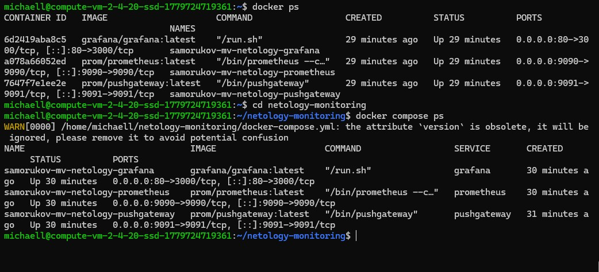
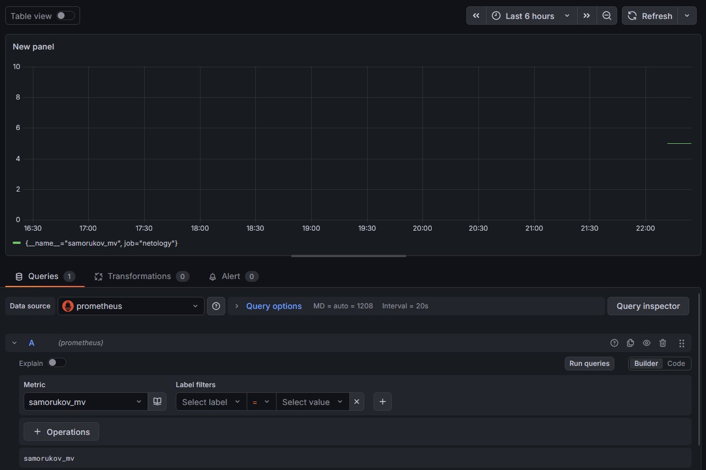
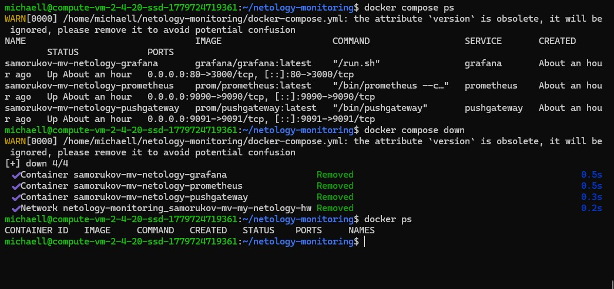

# Домашнее задание к занятию "`Docker. Часть 2`" - `Саморуков Михаил`


---

### Задание 1

Напишите ответ в свободной форме, не больше одного абзаца текста.

Установите Docker Compose и опишите, для чего он нужен и как может улучшить лично вашу жизнь.

1. Docker Compose — это инструмент для оркестрации и управления многоконтейнерными приложениями, позволяющий описывать всю инфраструктуру (сервисы, сети, тома) в одном конфигурационном файле YAML и запускать её одной командой. Лично мою жизнь он улучшает тем, что избавляет от необходимости вручную писать длинные и сложные команды docker run для каждого компонента, автоматизирует настройку связей между Prometheus, Grafana и Pushgateway, а также гарантирует быструю, идентичную и безошибочную разворачиваемость всей системы мониторинга на любом сервере.

` Без скриншотов `


---

### Задание 2

Выполните действия и приложите текст конфига на этом этапе.

Создайте файл docker-compose.yml и внесите туда первичные настройки:

    version;
    services;
    volumes;
    networks.

При выполнении задания используйте подсеть 10.5.0.0/16. Ваша подсеть должна называться: <ваши фамилия и инициалы>-my-netology-hw. Все приложения из последующих заданий должны находиться в этой конфигурации.

1. `Создаем структуру и настраиваем сеть 10.5.0.0/16.`


```
version: '3.8'

networks:
  samorukov-mv-my-netology-hw:
    driver: bridge
    ipam:
      config:
        - subnet: 10.5.0.0/16

volumes:
  prometheus-data:
  grafana-data:

services:

```

`Без скриншотов`


---

### Задание 3

Выполните действия:
Создайте конфигурацию docker-compose для Prometheus с именем контейнера <ваши фамилия и инициалы>-netology-prometheus.
Добавьте необходимые тома с данными и конфигурацией (конфигурация лежит в репозитории в директории 6-04/prometheus ).
Обеспечьте внешний доступ к порту 9090 c докер-сервера.


1. `Имя контейнера: samorukov-mv-netology-prometheus. Подключаем конфигурационный файл prometheus.yml через том и пробрасываем порт 9090.`


```
version: '3.8'

networks:
  samorukov-mv-my-netology-hw:
    driver: bridge
    ipam:
      config:
        - subnet: 10.5.0.0/16

volumes:
  prometheus-data:
  grafana-data:

services:
  prometheus:
    image: prom/prometheus:latest
    container_name: samorukov-mv-netology-prometheus
    ports:
      - "9090:9090"
    volumes:
      - ./prometheus.yml:/etc/prometheus/prometheus.yml
      - prometheus-data:/prometheus
    networks:
      - samorukov-mv-my-netology-hw

```

`Без скриншота`

---

### Задание 4

Создайте конфигурацию docker-compose для Pushgateway с именем контейнера <ваши фамилия и инициалы>-netology-pushgateway.
Обеспечьте внешний доступ к порту 9091 c докер-сервера.

1. `Имя контейнера: samorukov-mv-netology-pushgateway. Пробрасываем порт 9091.`


```
version: '3.8'

networks:
  samorukov-mv-my-netology-hw:
    driver: bridge
    ipam:
      config:
        - subnet: 10.5.0.0/16

volumes:
  prometheus-data:
  grafana-data:

services:
  prometheus:
    image: prom/prometheus:latest
    container_name: samorukov-mv-netology-prometheus
    ports:
      - "9090:9090"
    volumes:
      - ./prometheus.yml:/etc/prometheus/prometheus.yml
      - prometheus-data:/prometheus
    networks:
      - samorukov-mv-my-netology-hw

  pushgateway:
    image: prom/pushgateway:latest
    container_name: samorukov-mv-netology-pushgateway
    ports:
      - "9091:9091"
    networks:
      - samorukov-mv-my-netology-hw

```

`Без скриншота`

---

### Задание 5
Создайте конфигурацию docker-compose для Grafana с именем контейнера <ваши фамилия и инициалы>-netology-grafana.
Добавьте необходимые тома с данными и конфигурацией (конфигурация лежит в репозитории в директории 6-04/grafana.
Добавьте переменную окружения с путем до файла с кастомными настройками (должен быть в томе), в самом файле пропишите логин=<ваши фамилия и инициалы> пароль=netology.
Обеспечьте внешний доступ к порту 3000 c порта 80 докер-сервера.

1. `Имя контейнера: samorukov-mv-netology-grafana. Доступ с порта 80 докер-сервера на порт 3000 контейнера (80:3000). Подключаем custom.ini через том и задаем переменную окружения GF_PATHS_CONFIG.`

```
version: '3.8'

networks:
  samorukov-mv-my-netology-hw:
    driver: bridge
    ipam:
      config:
        - subnet: 10.5.0.0/16

volumes:
  prometheus-data:
  grafana-data:

services:
  prometheus:
    image: prom/prometheus:latest
    container_name: samorukov-mv-netology-prometheus
    ports:
      - "9090:9090"
    volumes:
      - ./prometheus.yml:/etc/prometheus/prometheus.yml
      - prometheus-data:/prometheus
    networks:
      - samorukov-mv-my-netology-hw

  pushgateway:
    image: prom/pushgateway:latest
    container_name: samorukov-mv-netology-pushgateway
    ports:
      - "9091:9091"
    networks:
      - samorukov-mv-my-netology-hw

  grafana:
    image: grafana/grafana:latest
    container_name: samorukov-mv-netology-grafana
    ports:
      - "80:3000"
    environment:
      - GF_PATHS_CONFIG=/etc/grafana/custom.ini
    volumes:
      - grafana-data:/var/lib/grafana
      - ./custom.ini:/etc/grafana/custom.ini
    networks:
      - samorukov-mv-my-netology-hw


```

`Без скриншота`

---

### Задание 6
Настройте поочередность запуска контейнеров.
Настройте режимы перезапуска для контейнеров.
Настройте использование контейнерами одной сети.
Запустите сценарий в detached режиме.


1. `Добавляем depends_on для очередности запуска (Prometheus и Grafana зависят от Pushgateway) и политику перезапуска restart: always для всех сервисов. Все приложения объединены в общую сеть. `

```
version: '3.8'

networks:
  samorukov-mv-my-netology-hw:
    driver: bridge
    ipam:
      config:
        - subnet: 10.5.0.0/16

volumes:
  prometheus-data:
  grafana-data:

services:
  pushgateway:
    image: prom/pushgateway:latest
    container_name: samorukov-mv-netology-pushgateway
    restart: always
    ports:
      - "9091:9091"
    networks:
      - samorukov-mv-my-netology-hw

  prometheus:
    image: prom/prometheus:latest
    container_name: samorukov-mv-netology-prometheus
    restart: always
    ports:
      - "9090:9090"
    volumes:
      - ./prometheus.yml:/etc/prometheus/prometheus.yml
      - prometheus-data:/prometheus
    networks:
      - samorukov-mv-my-netology-hw
    depends_on:
      - pushgateway

  grafana:
    image: grafana/grafana:latest
    container_name: samorukov-mv-netology-grafana
    restart: always
    ports:
      - "80:3000"
    environment:
      - GF_PATHS_CONFIG=/etc/grafana/custom.ini
    volumes:
      - grafana-data:/var/lib/grafana
      - ./custom.ini:/etc/grafana/custom.ini
    networks:
      - samorukov-mv-my-netology-hw
    depends_on:
      - pushgateway

```

`Без скриншота`

---

### Задание 7
Выполните запрос в Pushgateway для помещения метрики <ваши фамилия и инициалы> со значением 5 в Prometheus: echo "<ваши фамилия и инициалы> 5" | curl --data-binary @- http://localhost:9091/metrics/job/netology.
Залогиньтесь в Grafana с помощью логина и пароля из предыдущего задания.
Cоздайте Data Source Prometheus (Home -> Connections -> Data sources -> Add data source -> Prometheus -> указать "Prometheus server URL = http://prometheus:9090" -> Save & Test).
Создайте график на основе добавленной в пункте 5 метрики (Build a dashboard -> Add visualization -> Prometheus -> Select metric -> Metric explorer -> <ваши фамилия и инициалы -> Apply.

1. `docker-compose.yml целиком;
скриншот команды docker ps после запуске docker-compose.yml;
скриншот графика, постоенного на основе вашей метрики.`

```
version: '3.8'

networks:
  samorukov-mv-my-netology-hw:
    driver: bridge
    ipam:
      config:
        - subnet: 10.5.0.0/16

volumes:
  prometheus-data:
  grafana-data:

services:
  pushgateway:
    image: prom/pushgateway:latest
    container_name: samorukov-mv-netology-pushgateway
    restart: always
    ports:
      - "9091:9091"
    networks:
      - samorukov-mv-my-netology-hw

  prometheus:
    image: prom/prometheus:latest
    container_name: samorukov-mv-netology-prometheus
    restart: always
    ports:
      - "9090:9090"
    volumes:
      - ./prometheus.yml:/etc/prometheus/prometheus.yml
      - prometheus-data:/prometheus
    networks:
      - samorukov-mv-my-netology-hw
    depends_on:
      - pushgateway

  grafana:
    image: grafana/grafana:latest
    container_name: samorukov-mv-netology-grafana
    restart: always
    ports:
      - "80:3000"
    environment:
      - GF_PATHS_CONFIG=/etc/grafana/custom.ini
    volumes:
      - grafana-data:/var/lib/grafana
      - ./custom.ini:/etc/grafana/custom.ini
    networks:
      - samorukov-mv-my-netology-hw
    depends_on:
      - pushgateway

```





---

### Задание 8
Выполните действия:
Остановите и удалите все контейнеры одной командой.
В качестве решения приложите скриншот консоли с проделанными действиями.

1. ` docker compose down `


 

---
